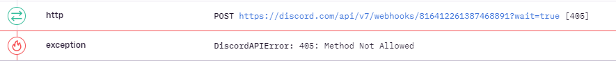
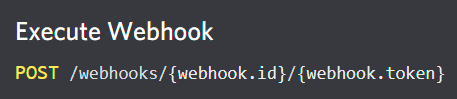

# Discord.js Webhook Send Reproduction

## Build and run the demo

* `git clone git@github.com:dallastjames/discordjs-webhook-send-error.git`
* `npm i`
* Add a bot key to the required location in `index.ts` file
* `npm run build && npm run start`

## Available Commands

### `!!register`

Registers a webhook for the channel. The bot must have Manage Webhooks permissions! It will print out the command required to attempt to send a message with the registered webhook.

### `!!send {webhookID} {webhookToken} {message content}`

Attempts to send a message using the webhook information provided.

## Error Details

When running the send command, a `DiscordAPIError: 405: Method Not Allowed` error is thrown. This looks to be because the url for sending webhooks is malformed (missing the webhookToken).

